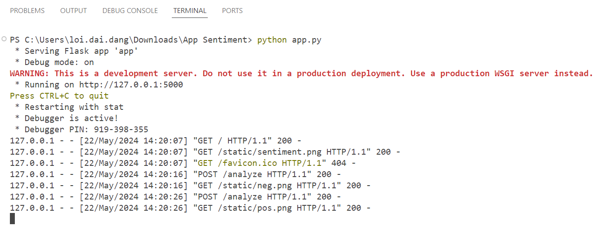
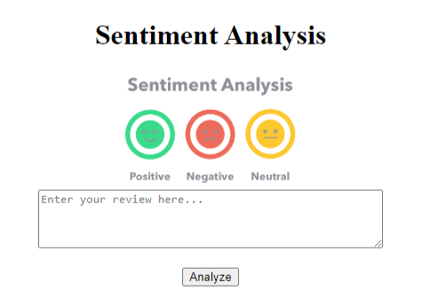
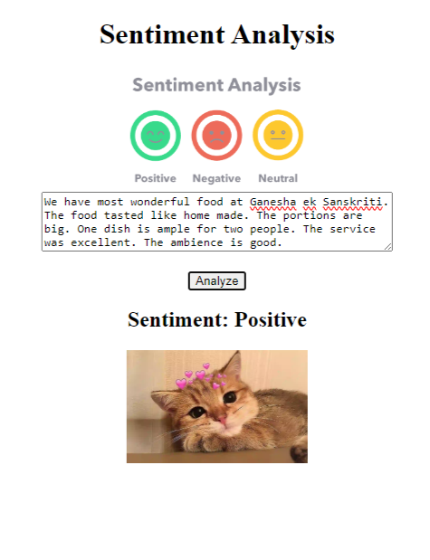
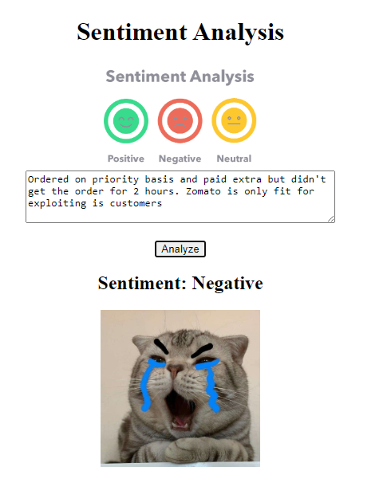

# Sentiment Analysis Application

## Giới thiệu
Ứng dụng "Sentiment Analysis" là một dự án phân tích cảm xúc cho các đánh giá nhà hàng sử dụng Python và Flask. Ứng dụng cho phép người dùng nhập đoạn văn bản, phân tích cảm xúc và hiển thị hình ảnh tương ứng với kết quả phân tích.

## Về Dữ liệu
- **Nguồn**: [Restaurant Review Sentiment Analysis](https://github.com/manthanpatel98/Restaurant-Review-Sentiment-Analysis/tree/master)
- **Mô tả**: Dữ liệu bao gồm 10000 dòng và 8 cột.
- **Cột sử dụng**: `Review` và `Rating`
- **Mục tiêu**: Thực hiện phân tích cảm xúc bằng cách coi các đánh giá có điểm số trên 3 là "Positive" và dưới 3 là "Negative".

## Mô hình
Dự án sử dụng 3 mô hình: Naive Bayes, SVM, và LSTM để đo lường hiệu suất và chọn mô hình tốt nhất.

## Cấu trúc Thư mục
- `app.py`: File chính chạy ứng dụng Flask.
- `notebook.ipynb`: Notebook Jupyter chứa mã nguồn để huấn luyện và đánh giá các mô hình.
- `requirements.txt`: Danh sách các thư viện Python cần thiết.
- `index.html`: Giao diện web cho ứng dụng.
- `label_encoder.pkl`: File lưu trữ label encoder.
- `svm_model.pkl`: File lưu trữ mô hình SVM đã huấn luyện.
- `tfidf_vectorizer.pkl`: File lưu trữ TF-IDF vectorizer.

## Hướng dẫn Cài đặt và Chạy Ứng dụng
### Bước 1: Cài đặt các Thư viện Cần thiết
Cài đặt các thư viện Python cần thiết bằng cách chạy lệnh sau:
```bash
pip install -r requirements.txt
```

### Bước 2: Tạo Cấu trúc Thư mục
Đảm bảo rằng các file và thư mục sau đã được tạo:
- `app.py`
- `notebook.ipynb`
- `requirements.txt`
- `index.html`
- `label_encoder.pkl`
- `svm_model.pkl`
- `tfidf_vectorizer.pkl`

### Bước 3: Huấn luyện và Lưu Mô hình
Mở và chạy notebook `notebook.ipynb` để huấn luyện và lưu trữ các mô hình.

### Bước 4: Chạy Ứng dụng Flask
Chạy ứng dụng Flask bằng lệnh:
```bash
python app.py
```

### Bước 5: Kiểm tra Ứng dụng
Mở trình duyệt web và truy cập [http://127.0.0.1:5000/](http://127.0.0.1:5000/) để xem ứng dụng hoạt động. Nhập đoạn văn bản và nhấn nút "Analyze" hoặc ấn phím "Enter" để xem kết quả phân tích cảm xúc.

## Giao diện

Dưới đây là một số hình ảnh về giao diện của ứng dụng phân tích cảm xúc.
### Khởi động ứng dụng
<p align="center">
  
</p>

Sau khi chạy ứng dụng hãy mở trình trình web và truy cập [http://127.0.0.1:5000/](http://127.0.0.1:5000/) để xem ứng dụng hoạt động

### Trang chủ

<p align="center">
  
</p>

### Phân tích cảm xúc (Positive)
<p align="center">
  
</p>

### Phân tích cảm xúc (Negative)
<p align="center">
  
</p>

## Liên hệ
Nếu có bất kỳ câu hỏi hoặc góp ý nào, vui lòng liên hệ qua email: dailoi.ddl@gmail.com.